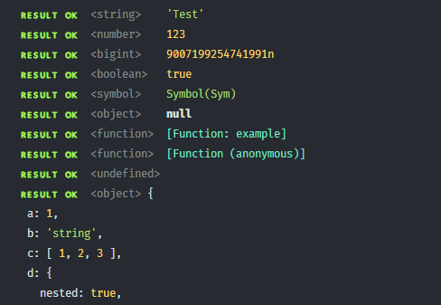
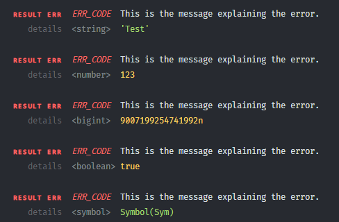
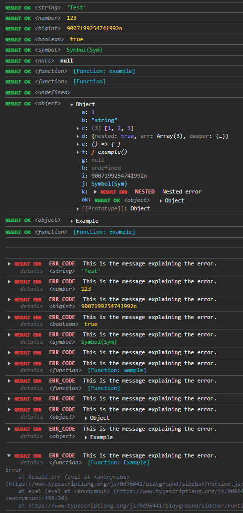

## Pretty `Console Log`s

### Terminal

 

### Browser

> [!NOTE]  
> To enable pretty logs in the browser,
> enable `Custom formatters` in `DevTools` settings.  
> It can be found under [`Tab: Preferences → Section: Console → Option: Custom Formatters`](https://medium.com/@tomsu/devtools-tips-day-10-custom-formatters-58ee46e640f9)

